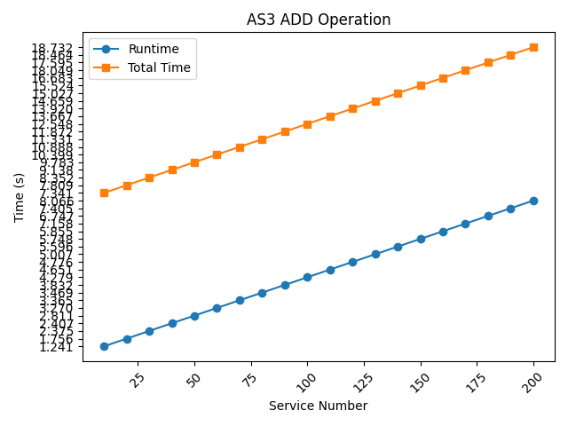

= AS3 Performance Benchmark
:toc: manual

[source, bash]
.*Run From Source Code*
----
go mod init github.com/kylinsoong/golang/as3-benchmark
go mod tidy
go run cmd/as3-benchmark/main.go --ops=add --declaration=$(pwd)/declaration.json --bigip-host=10.155.223.51 --bigip-username=admin --bigip-password=admin
go run cmd/as3-benchmark/main.go --ops=del --declaration=$(pwd)/declaration.json --bigip-host=10.155.223.51 --bigip-username=admin --bigip-password=admin
----

* link:one-tenant.sh[one-tenant.sh]
* link:one-tenant/results[one-tenant/results]

[source, bash]
.*one tenant*
----
for i in {1..10} ; do ./one-tenant.sh ; done
----

[source, bash]
.*multiple tenants*
----
for i in {1..10} ; do ./mul-tenants.sh ; done > mul-tenants/results
----

[source, bash]
.*one tenant*
----
./results.py one-tenant/results 
----

[source, bash]
.*multiple tenants*
----
./results.py mul-tenants/results
----

[cols="2,5a"]
.*AS3 Performance Benchmark*
|===
|ITEM |RESULTS

|one tenant add
|

|one tenant delete
|

|multiple tenants add
|image:img/[]

|multiple tenants delete
|image:img/[]
|===
