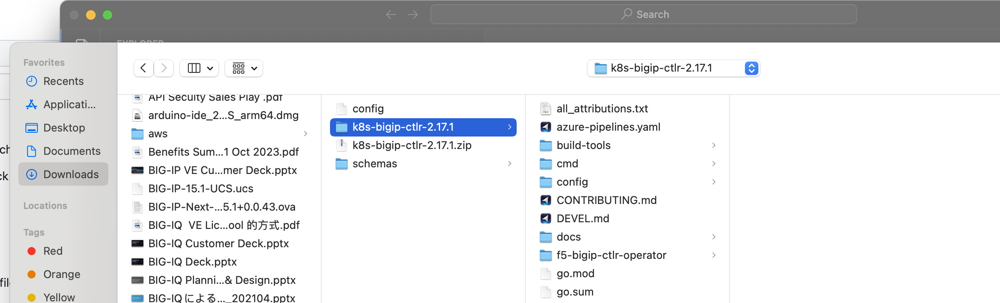
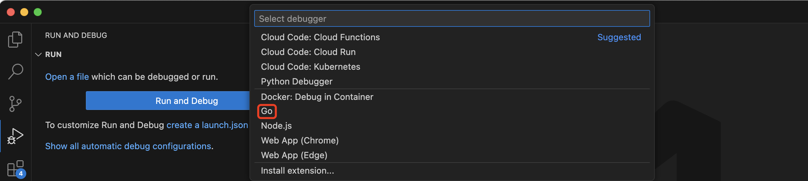

= bigip container codebase debug 
:toc: manual

== Set up local environment

=== Prepare a k8s environment

[source, bash]
.*1. create a single node K8S cluster*
----
kk create cluster
----

[source, bash]
.*2. create a test application*
----
kubectl apply -f nginx.yaml
----

* link:etc/files/nginx.yaml[nginx.yaml]

[source, bash]
.*3. test application*
----
~# curl http://$NODE_IP:30007 -I
HTTP/1.1 200 OK
Server: nginx/1.27.1
Date: Mon, 23 Sep 2024 03:49:09 GMT
Content-Type: text/plain
Content-Length: 405
Connection: keep-alive
----

[source, bash]
.*4. clean application*
----
kubectl delete -f nginx.yaml 
----

=== Start AS3 Mock Service

[source, bash]
.*1. Start AS3 Mock*
----
docker run -it --rm -p 443:443 cloudadc/as3-mock:0.5
----

[source, bash]
.*2. Test AS3 Mock*
----
% curl -s -k -u "admin:admin" -X GET https://127.0.0.1/mgmt/shared/appsvcs/info
{
  "version": "3.36.1",
  "release": "1",
  "schemaCurrent": "3.36.0",
  "schemaMinimum": "3.0.0"
}
----

=== Get Source Code

*1. Download Source Code*

* All Release: https://github.com/F5Networks/k8s-bigip-ctlr/releases
* 2.17.1: https://github.com/F5Networks/k8s-bigip-ctlr/archive/refs/tags/v2.17.1.zip

[source, bash]
.*2. Prepare Source Code*
----
unzip k8s-bigip-ctlr-2.17.1.zip 
cd k8s-bigip-ctlr-2.17.1
vim cmd/k8s-bigip-ctlr/main.go
----

[source, bash]
.*3. Comment out from line 1122 to line 1154*
----
1122 /*              
1123                 bs := bigIPSection{
1124                         BigIPUsername:   *bigIPUsername,
1125                         BigIPPassword:   *bigIPPassword,
1126                         BigIPURL:        *bigIPURL,
1127                         BigIPPartitions: *bigIPPartitions,
1128                 }
1129                 
1130                 subPidCh, err := startPythonDriver(getConfigWriter(), gs, bs, *pythonBaseDir)
1131                 if nil != err {
1132                         log.Fatalf("Could not initialize subprocess configuration: %v", err)
1133                 }
1134                 subPid := <-subPidCh
1135                 defer func(pid int) {
1136                         if 0 != pid {
1137                                 var proc *os.Process
1138                                 proc, err = os.FindProcess(pid)
1139                                 if nil != err {
1140                                         log.Warningf("Failed to find sub-process on exit: %v", err)
1141                                 }
1142                                 err = proc.Signal(os.Interrupt)
1143                                 if nil != err {
1144                                         log.Warningf("Could not stop sub-process on exit: %d - %v", pid, err)
1145                                 }
1146                         }
1147                 }(subPid)
1148                 
1149                 // Add health check e.g. is Python process still there?
1150                 hc := &health.HealthChecker{
1151                         SubPID: subPid,
1152                 }
1153                 http.Handle("/health", hc.HealthCheckHandler())
1154 */ 
----

[source, bash]
.*4. Delete test code in main directory*
----
rm cmd/k8s-bigip-ctlr/main_test.go 
cmd/k8s-bigip-ctlr/k8s_bigip_ctlr_suite_test.go
rm cmd/k8s-bigip-ctlr/test/*
----

=== Run Code

[source, bash]
.*1. Copy K8S config*
----
cat ~/.kube/config
----

[source, bash]
.*2. Prepare dependencies*
----
go mod tidy
----

[source, bash]
.*3. Start Code*
----
go run cmd/k8s-bigip-ctlr/*.go --bigip-username=admin --bigip-password=admin --bigip-url=127.0.0.1 --log-level=DEBUG --running-in-cluster=false --kubeconfig=/Users/k.song/Downloads/cis/config --hubmode=true --manage-ingress=false --manage-configmaps=true --insecure=true --filter-tenants=true --pool-member-type=cluster --bigip-partition=k8s --log-as3-response=true --schema-db-base-dir=file:///Users/k.song/Downloads/cis/k8s-bigip-ctlr-2.17.1/schemas/ --disable-teems=true --periodic-sync-interval=60 --namespace-label=cis.f5.com/zone=zone-1
----

*Optionally, use below commands to run older version code:*

[source, bash]
.*Run 2.9.1*
----
go run cmd/k8s-bigip-ctlr/*.go --bigip-username=admin --bigip-password=admin --bigip-url=127.0.0.1 --log-level=INFO --running-in-cluster=false --kubeconfig=/Users/k.song/src/golang/config --namespace=f5-hub-1 --namespace=f5-hub-2 --node-poll-interval=300 --periodic-sync-interval=36000 --hubmode=true --manage-ingress=false --manage-configmaps=true --insecure=true --filter-tenants=true --pool-member-type=cluster --bigip-partition=k8s --log-as3-response=true --schema-db-base-dir=file:///Users/k.song/src/golang/k8s-bigip-ctlr-2.9.1-1/schemas/
----

[source, bash]
.*Run 2.16.1*
----
go run cmd/k8s-bigip-ctlr/*.go --bigip-username=admin --bigip-password=admin --bigip-url=192.168.72.100 --log-level=INFO --running-in-cluster=false --kubeconfig=/Users/k.song/src/golang/config --namespace=f5-hub-1 --namespace=f5-hub-2 --node-poll-interval=300 --periodic-sync-interval=36000 --hubmode=true --manage-ingress=false --manage-configmaps=true --insecure=true --filter-tenants=true --pool-member-type=cluster --bigip-partition=k8s --log-as3-response=true --schema-db-base-dir=file:///Users/k.song/src/golang/k8s-bigip-ctlr-2.16.1/schemas/
----

[source, bash]
.*Run 2.16.1 - namespace*
----
go run cmd/k8s-bigip-ctlr/*.go --bigip-username=admin --bigip-password=admin --bigip-url=127.0.0.1 --log-level=DEBUG --running-in-cluster=false --kubeconfig=/Users/k.song/src/golang/config --namespace=f5-hub-1 --namespace=cistest001 --namespace=cistest002 --namespace=cistest003 --node-poll-interval=3600 --periodic-sync-interval=3600 --manage-ingress=false --manage-configmaps=true --insecure=true --filter-tenants=true --hubmode=true --pool-member-type=cluster --bigip-partition=k8s --log-as3-response=true --schema-db-base-dir=file:///Users/k.song/src/golang/k8s-bigip-ctlr-2.16.1/schemas/
----

== Run via VS Code

=== Open Source Code in VS Code

=== Create go lunch.json

[source, json]
.*launch.json*
----
{
    "version": "0.2.0",
    "configurations": [
        {
            "name": "Launch Package",
            "type": "go",
            "request": "launch",
            "mode": "auto",
            "program": "/Users/k.song/Downloads/cis/k8s-bigip-ctlr-2.17.1/cmd/k8s-bigip-ctlr",
            "env": {},
            "args": [
                "--bigip-username=admin",
                "--bigip-password=admin",
                "--bigip-url=127.0.0.1",
                "--log-level=DEBUG",
                "--running-in-cluster=false",
                "--kubeconfig=/Users/k.song/Downloads/cis/config",
                "--periodic-sync-interval=120",
                "--manage-ingress=false",
                "--manage-configmaps=true",
                "--insecure=true",
                "--hubmode=true",
                "--filter-tenants=true",
                "--pool-member-type=cluster",
                "--bigip-partition=k8s",
                "--log-as3-response=true",
                "--disable-teems=true",
                "--schema-db-base-dir=file:///Users/k.song/Downloads/cis/k8s-bigip-ctlr-2.17.1/schemas/",
                "--namespace-label=cis.f5.com/zone=zone-1"
            ]
        }
    ]
}
----
